# VisualWegovy

**AR Color Filter-Based Appetite Suppression System**

> A non-pharmacological HCI intervention that applies a real-time blue color LUT filter over food via Meta Quest 3 Passthrough, aiming to suppress appetite through the well-established color–food association mechanism.

[](https://youtu.be/HfTnOL91RyU)


---

## Overview

VisualWegovy is an AR/MR system developed for **Meta Quest 3** that overlays a blue LUT (Look-Up Table) color filter spatially onto food during a meal. The filter exploits the neurological color–appetite link — blue is almost absent in naturally edible foods and is known to suppress appetite through color–food association — to modulate eating behavior without any physical or pharmacological intervention.

The project was developed as an HCI research tool for a between-subject controlled experiment investigating:

| # | Research Question | Metric | Timepoint |
|---|---|---|---|
| **RQ1** | Does the AR blue filter reduce subjective appetite? | VAS appetite change (T0→T1) | T0, T1, T3 |
| **RQ2** | Does the AR blue filter affect taste perception? | Taste Likert 5-pt / Satiety VAS | T3 |

**Supplementary indicators:** food consumed (g) and eating speed (g/min) measured at T2 to contextualize behavioral outcomes alongside the primary subjective measures.

---

## Background & Motivation

Prior research on visual color manipulation and food intake has been largely confined to 2D screen-based controlled laboratory settings. This project introduces a **Mixed Reality (MR)** approach that applies the color stimulus spatially to the food itself in a real eating environment, closing the ecological validity gap.

Key references underpinning the design:

- **Spence (2015)** — food color directly affects taste expectations and food perception
- **Rüttgen et al. (2020)** — visual color manipulation can alter food preference and intake desire
- **Flint et al. (2000)** — VAS-based appetite measurement methodology
- **Blundell et al. (2010)** — appetite regulation model

---

## How It Works

### Hardware

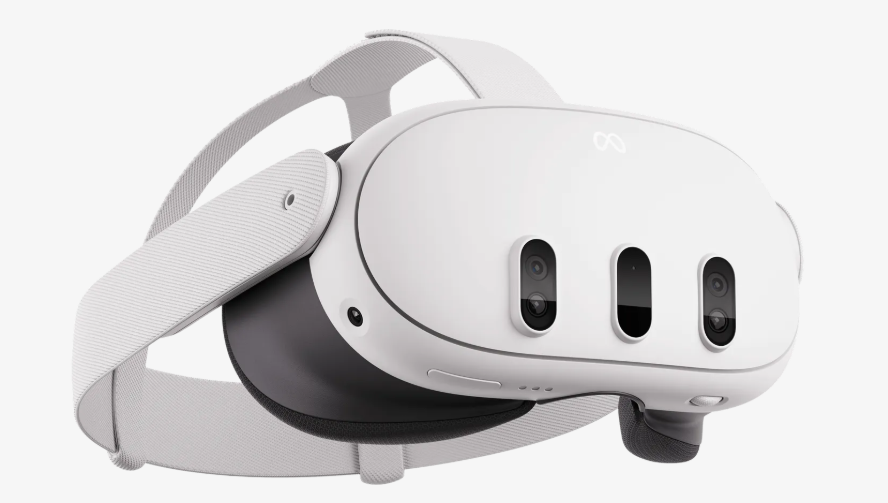

### Rendering Architecture - Dual Passthrough Layer

Meta Quest 3's **Passthrough** feature renders real-world camera imagery inside the headset display. VisualWegovy uses two stacked `OVRPassthroughLayer` components:

```
OVRCameraRig
├── Passthrough_background  (Placement: Underlay)
│     └── Renders the full real-world background in color
└── Passthrough_Filter      (Placement: Overlay, Color Control: LUT)
      └── Renders only the mesh-masked region with the blue LUT applied
            LUT file: Assets/LUT/16_16_blue_filter.png (16×16×16 resolution)
```

The filter is projected onto a **Quad mesh** positioned above the food. Only the food within that spatial region is tinted blue; the rest of the environment remains in full color.

### LUT Filter

The `16_16_blue_filter.png` LUT was created in **GIMP** to shift the full color spectrum toward blue–purple tones, suppressing the warm (red, orange, yellow) colors typical of food:

| Original LUT | Blue Filter LUT |
|:---:|:---:|
| 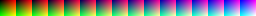 | 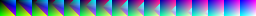 |

### 2-Layer Rendering Diagram

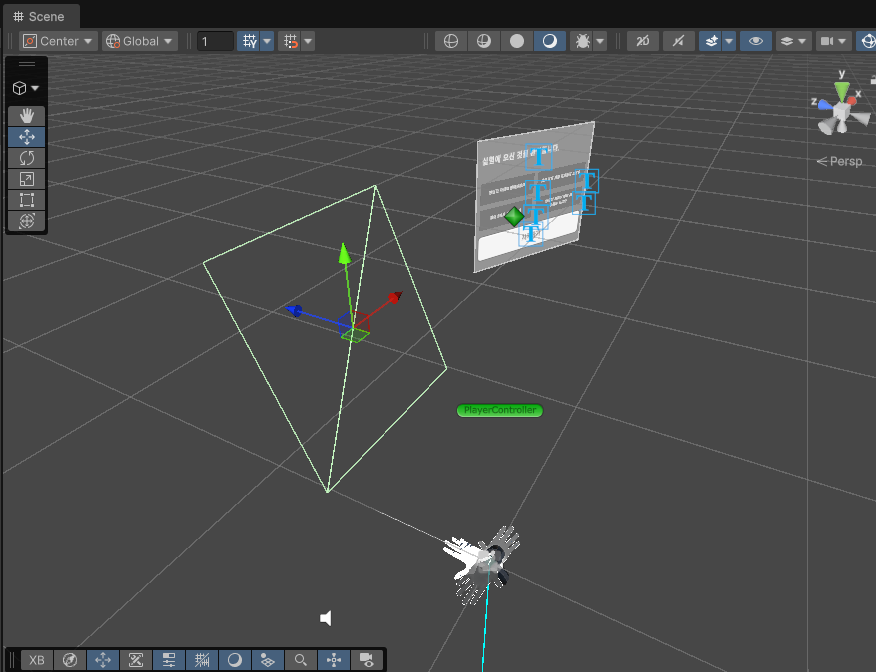

### Filter: ON vs. OFF

| Blue Filter ON | Normal Color |
|:---:|:---:|
| 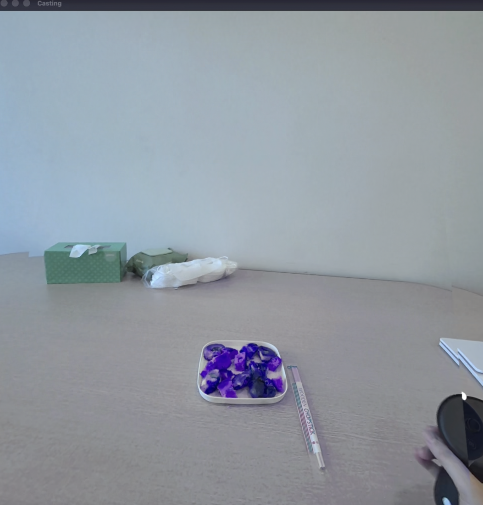 | 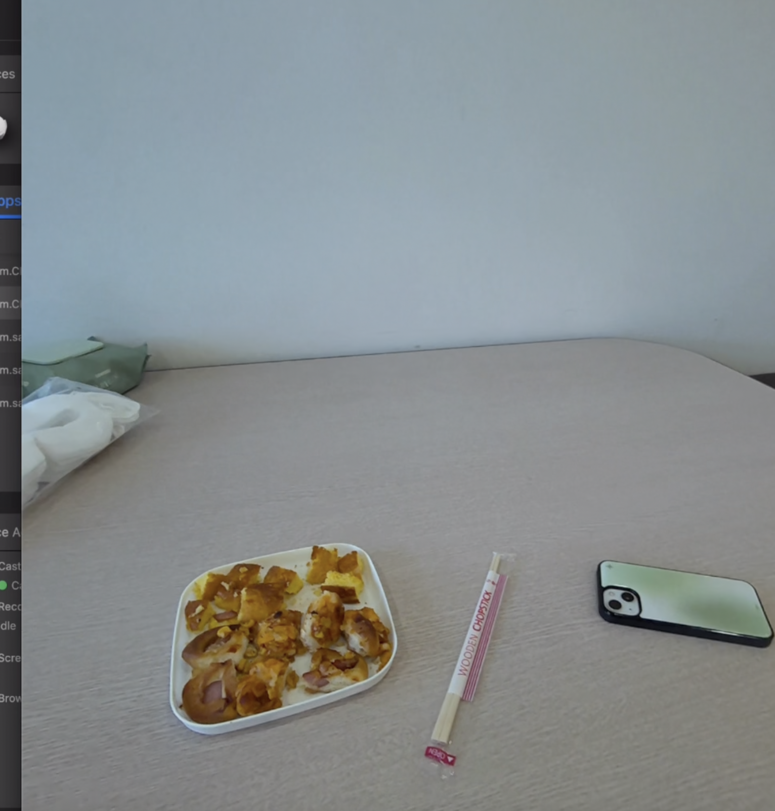 |

---

## Experiment Protocol (T0 → T1 → T2 → T3)

```
T0  Baseline (~2 min)
    • VAS appetite self-report (0–100 mm slider)
    • Pre-questionnaire (BMI, dietary restrictions)

T1  Headset On (~2 min)
    • Researcher assists with Quest 3 fitting, condition activated
    • VAS appetite re-measured immediately after headset on
    • Instruction: "Visual effects may or may not appear."

T2  Free Eating (max 10 min)
    • Participant eats freely; self-declares when done
    • Observer records: stop-and-restart count, headset touches, eating duration
    • Mirror + screen recording active
    • Food weight measured before/after → intake (g) = pre − post

T3  Post-Meal (~10 min)
    • Headset removed; VAS re-measured
    • Satiety VAS + Taste Likert 5-point scale
    • Semi-structured retrospective Think-Aloud interview (9 questions)
      covering: visual change, appetite suppression, device discomfort,
      HCI usability (usage context, inconveniences, improvements)
    • Data auto-saved as JSON
```

**Exclusion criteria:** Color vision deficiency (color blindness), active eating disorder treatment, food allergy to provided snack.

| VAS Appetite Slider (T0/T1/T3) | Taste Evaluation Panel (T3) |
|:---:|:---:|
| 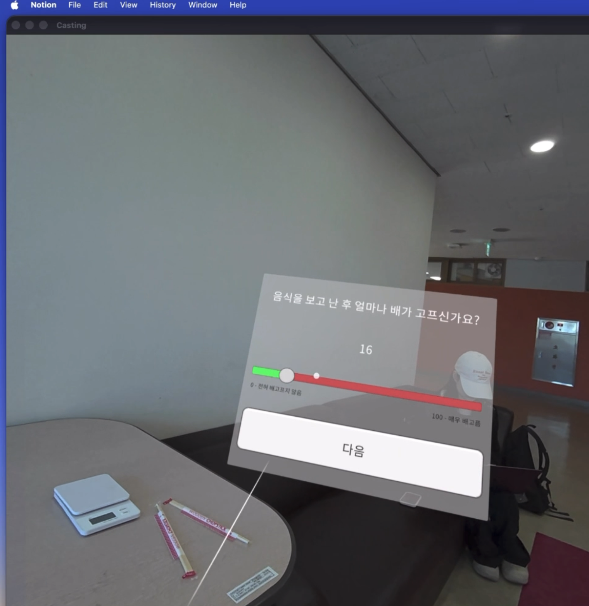 | 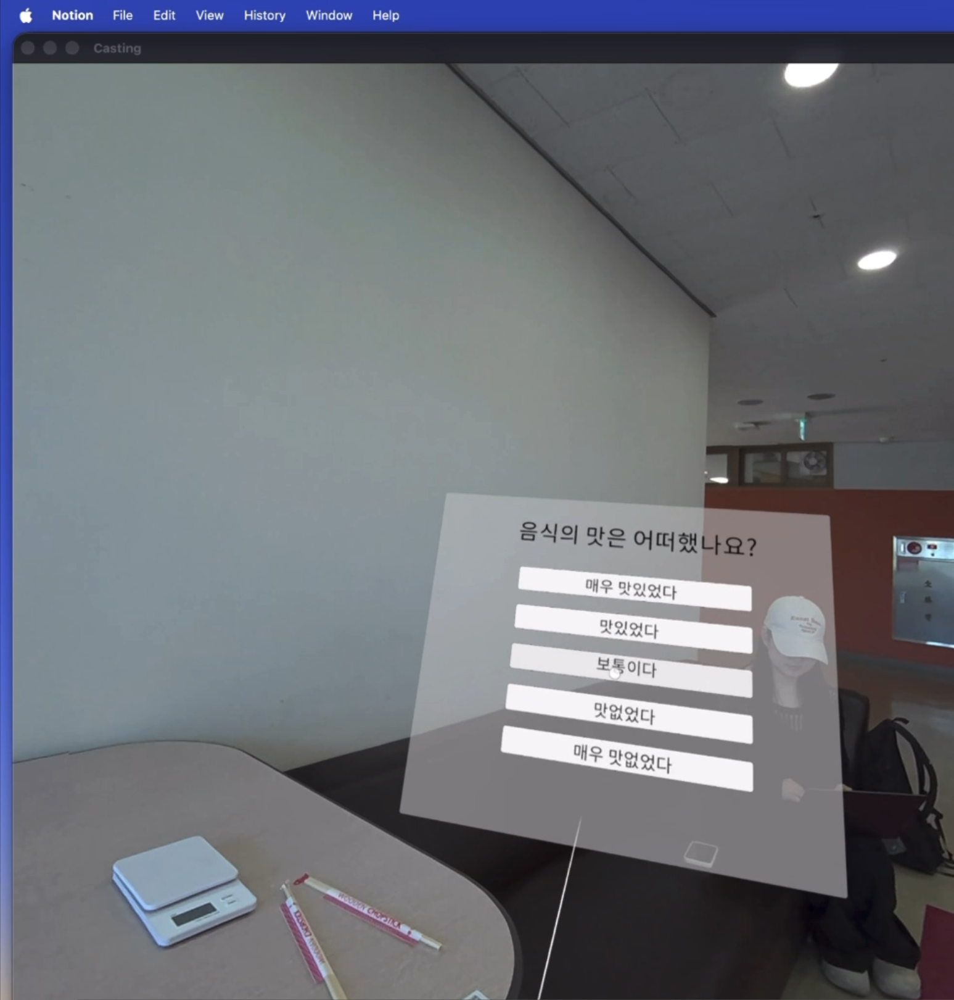 |

---

## System Architecture

```
VR/XR Input
  OVRCameraRig
  Passthrough_background   (Underlay)
  Passthrough_Filter       (Overlay, LUT: 16_16_blue_filter)

Physical Objects
  Filter Quad  — MeshFilter + MeshCollider, Scale 0.7  (placed over food)
  Cube         — food placement reference

Input / Pointable Canvas
  ISDK_RayCanvasInteraction  →  PointableCanvasModule
  ISDK_HandGrabInteraction   →  hand interaction with physical filter object

UI Canvas — Panel Sequence (managed by ExperimentManager)
  Panel_T0_Intro → VAS_0_Panel → Panel_T1_notice → VAS_1_Panel
                 → Panel_T2_notice → VAS_T2_Eval → Panel_End

Experiment Singleton
  ExperimentManager
    • filterType ("None" | "Blue")
    • panelSequence[]
    • NextPanel() / RecordVAS(index, value) / RecordEvaluationAndFinish(score)
    • SaveDataToJson()  →  Result_[Blue|None]_P001.json

Data Output (JSON, per participant)
  {
    "filterType": "Blue",
    "participantID": 1,
    "timestamp": "2026-05-14 10:23:01",
    "VAS_0_value": 65.0,   // T0 baseline appetite
    "VAS_1_value": 56.0,   // T1 after headset on
    "VAS_2_value": 40.0,   // T3 post-meal appetite
    "evaluation_value": 3  // Taste Likert (1–5)
  }
```

---

## Key Scripts

| Script | Location | Role |
|---|---|---|
| `ExperimentManager.cs` | `Assets/UI_Assets/Assets/Scripts/` | Singleton orchestrating panel flow, VAS recording, and JSON export |
| `VASController.cs` | `Assets/UI_Assets/Assets/Scripts/` | Reads slider value, calls `RecordVAS()`, advances panel |
| `EvaluationController.cs` | `Assets/UI_Assets/Assets/Scripts/` | 5-button taste evaluation, triggers `RecordEvaluationAndFinish()` |
| `SliderTextUpdater.cs` | `Assets/UI_Assets/Assets/Scripts/` | Live numeric display for VAS slider |
| `SimpleNextButton.cs` | `Assets/UI_Assets/Assets/Scripts/` | Generic panel-advance button |
| `UiCameraFollower.cs` | `Assets/Script/` | Keeps the UI canvas anchored to the user's view |

---

## Pilot Results (n=4, May 14, 2026)

Formative study — 4 participants (experimental Blue: n=2, control None: n=2), mixed methods (quantitative + qualitative).

**RQ1 — Appetite change** ✅ *Consistent with hypothesis*

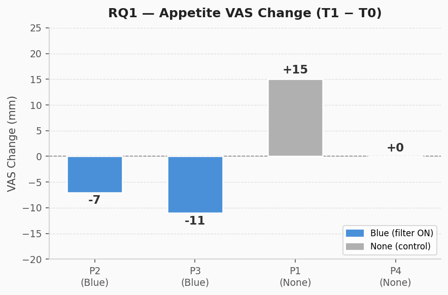

Blue condition showed a clearly larger appetite decrease immediately after headset-on (avg −9 pts) vs. control (avg +7.5 pts).

**RQ2 — Taste evaluation** ❌ *Inconsistent with hypothesis*

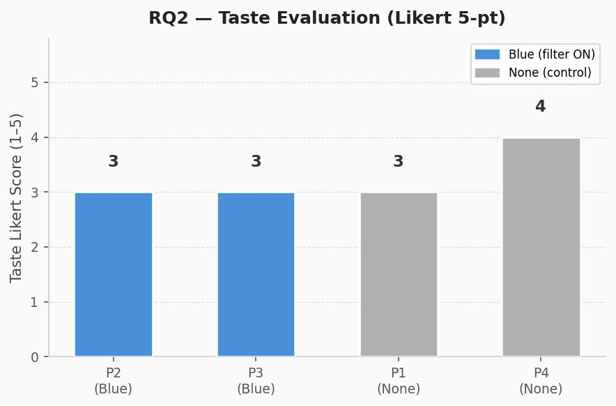

Taste suppression effect was unclear at the pilot level; Likert scores were nearly identical across conditions (Blue avg 3.0 / 5, None avg 3.5 / 5).

**Supplementary — Behavioral intake**

| 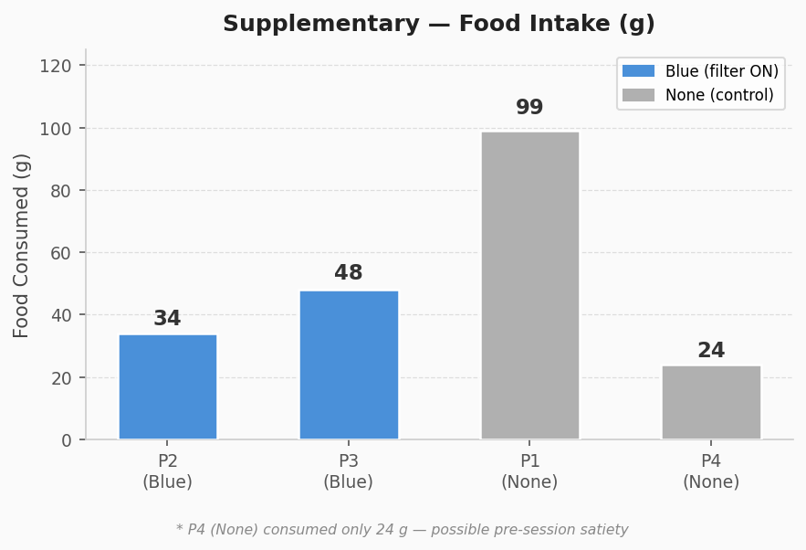 | 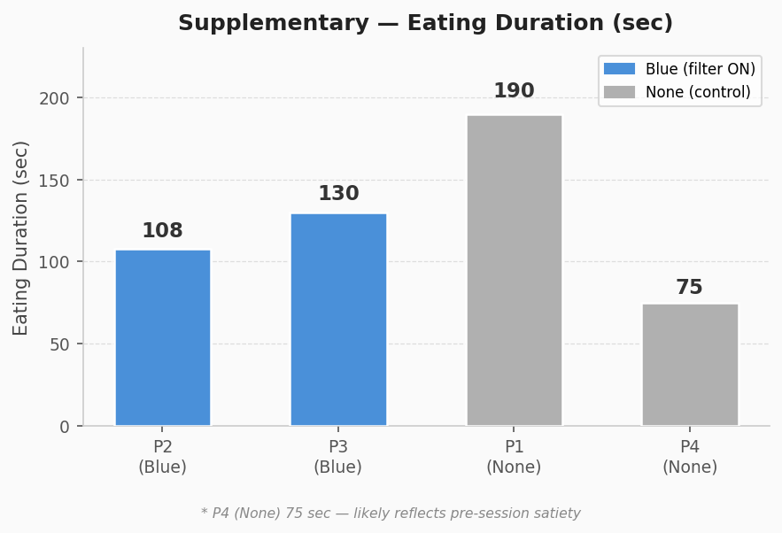 |
|:---:|:---:|
| Food Consumed (g) | Eating Duration (sec) |

| Metric | Blue | None |
|---|---|---|
| Food consumed (avg) | **41 g** | **61.5 g** |
| Eating speed (avg) | **20.5 g/min** | **25.2 g/min** |

Blue condition ate less and more slowly, consistent with the appetite suppression hypothesis. Note: P4 (None) consumed only 24 g in 75 sec — possible pre-session satiety.

All 4 participants spontaneously described the color–appetite mechanism in their retrospective interviews, consistent with Spence (2015). Protocol refinements applied to the main study: T0 VAS ≥ 40 inclusion criterion, device discomfort VAS item, 9-point Hedonic Scale for taste, unlimited water provision, and observer position adjustment.

---

## Requirements

| Requirement | Version |
|---|---|
| Unity | 6000.3.11f1 |
| Meta XR SDK (Interaction + MR Utility Kit) | 85.0.0 |
| com.unity.xr.openxr | 1.16.1 |
| Target device | Meta Quest 3 |
| Build platform | Android (arm64) |

---

## Getting Started

1. **Clone the repository**
   ```bash
   git clone https://github.com/<your-org>/Visual-Wegovy.git
   ```

2. **Open in Unity Hub** — select Unity 6000.3.11f1 with Android Build Support (including OpenJDK + Android SDK).

3. **Open the main scene**
   ```
   Assets/Scene/Visual_wegovy.unity
   ```

4. **Configure the condition** — select the `ExperimentManager` GameObject and set `Filter Type` to either `"Blue"` (experimental) or `"None"` (control) in the Inspector.

5. **Build to Quest 3** — File → Build Settings → Android → Build and Run. Ensure Developer Mode is enabled on the headset.

6. **Retrieve data** — result JSON files are written to `Application.persistentDataPath/Experiment_Results/` on the device. Pull with:
   ```bash
   adb pull /sdcard/Android/data/<package>/files/Experiment_Results/ ./results/
   ```

---

## Roadmap

- [ ] **Filter intensity slider** — let users adjust filter strength in real time for personalized intervention
- [ ] **Multiple filter types** — Gaussian and other non-color visual manipulations beyond blue
- [ ] **Disgust animation** — crawling insect overlay as an aversion-based appetite suppression variant
- [ ] **Spatial filter adjustment** — resize and reposition the filter region to accommodate different food layouts

---

## Demo

[](https://youtu.be/HfTnOL91RyU)

---

## License

The [`Oculus License`](./LICENSE.txt) applies to the SDK and supporting material. The [`MIT License`](./Assets/PassthroughCameraApiSamples/LICENSE.txt) applies to only certain, clearly marked documents. If an individual file does not indicate which license it is subject to, then the Oculus License applies.

- Files under [`Assets/PassthroughCameraApiSamples/MultiObjectDetection/SentisInference/Model`](./Assets/PassthroughCameraApiSamples/MultiObjectDetection/SentisInference/Model) are licensed under [`MIT`](https://github.com/MultimediaTechLab/YOLO/blob/main/LICENSE).

See [`CONTRIBUTING.md`](./CONTRIBUTING.md) for contribution guidelines.
